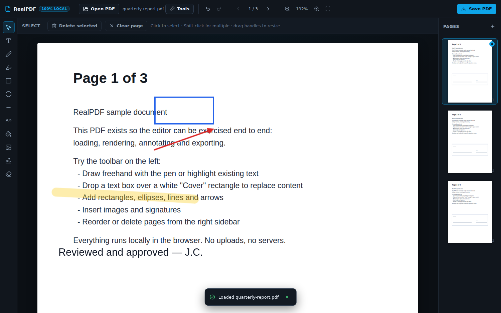
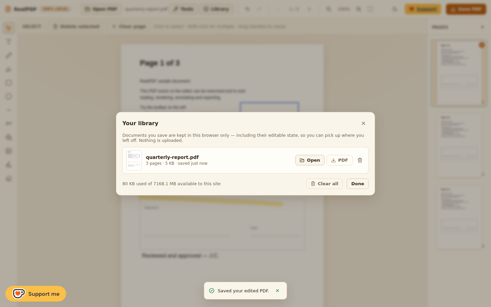
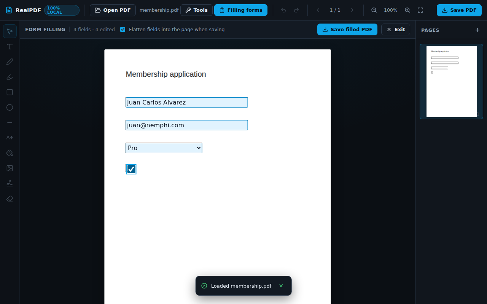
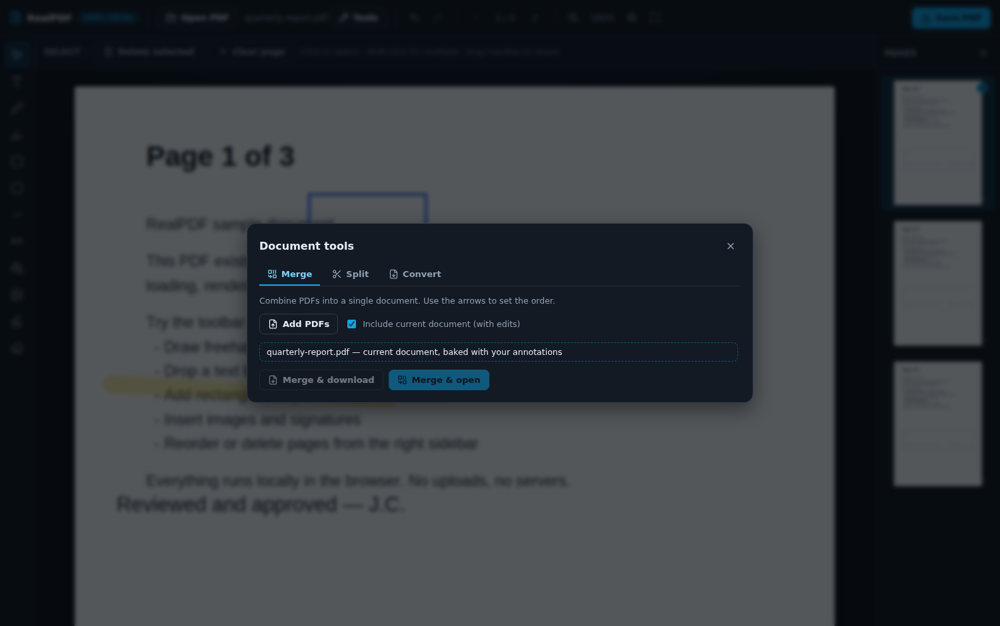
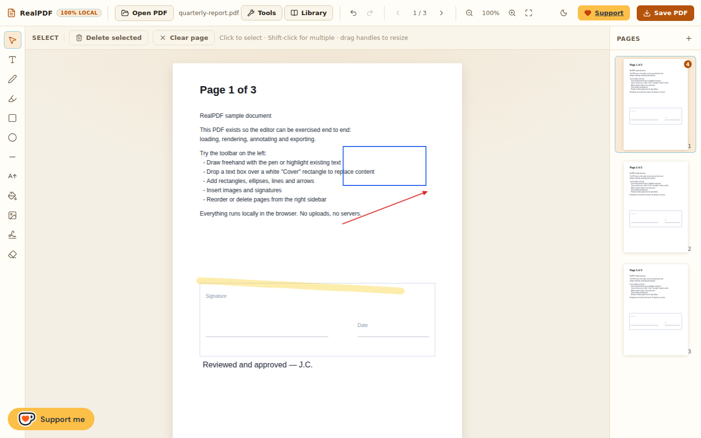

# RealPDF

A real PDF editor that runs **entirely in your browser**. No uploads, no servers, no accounts — your documents never leave your device.




## Features

**Edit & annotate**

- Freehand pen, highlighter (multiplied blend, like a real marker) and eraser
- Text boxes with font family/size/color, rectangles, ellipses, lines and arrows. Selecting any text activates the text tool, so its font, size and colour can be edited right away — the options always reflect and update the selected text.
- **Edit existing text in place**: click any text and retype it — the original font, size, colour and position are matched, the run is covered with the colour sampled from the page behind it, and the replacement is embedded with the same font program (subset per font). Re-click an edit to keep changing it, or erase it to reveal the original. A replacement that is selected can also be restyled with the text options.
- Cover existing content with white boxes and type over it to "replace" text
- Insert images (drag & drop or file picker) and signatures — draw them or **upload a photo/scan** (with automatic white-background removal)
- Select, move, resize, rotate and delete annotations, multi-select with Shift
- Undo/redo, zoom (25%–400%), fit-to-width, page navigation

**Local library**



- Every Save PDF is also recorded in this browser (IndexedDB): title, page count, size, thumbnail and timestamp
- Documents keep their **editable state** — annotations, page order and form values — so **Open** resumes exactly where you left off
- Rename, rebuild/download the PDF, delete single entries or clear everything; storage usage is shown
- Recent work appears on the homepage for one-click resume

**Pages**

- Reorder pages by dragging thumbnails, delete pages, insert blank pages
- Annotations are kept per page and survive reordering and scrolling (the viewer virtualizes pages)

**Forms**



- Detects AcroForm fields and overlays real inputs on top of the PDF: text fields, multiline text, checkboxes, radio groups, dropdowns and list boxes
- Values are written into the PDF on save, flattened by default so they render everywhere

**Document tools**



- **Merge** — combine any number of PDFs (optionally including the document you are editing, with annotations baked in), choose the order, download or open the result
- **Split** — extract page ranges (`1-3,5,8-`) or split every page into a ZIP
- **PDF → Images** — export pages as PNG or JPEG at 72/144/216 dpi, single page or all pages as a ZIP
- **PDF → Text** — download the text layer as `.txt`
- **Images → PDF** — turn PNG/JPEG/WebP/GIF/BMP files into a PDF, fit to A4 or page-per-image
- **Text → PDF** — render plain text into a paginated A4 PDF

Everything the tools produce uses your **current edited state** (annotations, page order, filled forms), not just the original file.

## Themes

Light (warm, paper-like) and dark themes, following your system preference by
default, with a one-click toggle in the toolbar.



## Languages

The interface ships in English, Spanish, French and German, with a picker in
the toolbar. The browser language is detected on the first visit, the chosen
language is remembered, and `<html lang>` / `dir`, the document title and
number/date formatting follow it. Adding a language is one dictionary file plus
one registry entry — see [docs/localization.md](docs/localization.md).

## Quick start

```bash
npm install
npm run dev          # http://localhost:5173
```

Production build (fully static, deploy anywhere):

```bash
npm run build        # outputs dist/ (includes the pdf.js worker + wasm/fonts/cmaps assets)
npm run preview
```

## How it works

| Layer | Technology |
| --- | --- |
| PDF rendering | [pdf.js](https://mozilla.github.io/pdf.js/) — Web Worker + **WebAssembly** decoders for JPEG 2000/ICC/JBIG2 (`wasm/`), plus CMaps and standard font data, all served from your own origin |
| Editing surface | [fabric.js](https://fabricjs.com/) canvas overlays (one per visible page), coordinates stored in PDF points |
| Saving | [pdf-lib](https://pdf-lib.js.org/) — annotations are re-drawn as native PDF operators, images embedded, new text mapped to Standard-14, edited text embedded with its original font (subset), highlights exported with a real Multiply blend mode |
| State | [zustand](https://zustand.docs.pmnd.rs/) store with snapshot-based undo/redo |
| ZIP export | dependency-free STORE-method zip writer (`src/lib/zip.ts`) |
| Localization | dependency-free typed dictionaries (`src/i18n/`) with `Intl.PluralRules` plurals and locale-aware number/date formatting |

Export works by walking every stored annotation, inverting the pdf.js viewport transform to get PDF user-space coordinates, and drawing lines/rectangles/ellipses/text/images with pdf-lib. Rotation and non-standard page boxes are handled by the same inverse transform, so what you see is what gets written.

### Keyboard shortcuts

| Key | Action |
| --- | --- |
| `V` `T` `X` `P` `H` `R` `O` `L` `A` `W` `I` `S` `E` | select, text, edit text, draw, highlight, rectangle, ellipse, line, arrow, cover, image, signature, eraser |
| `Ctrl/Cmd + Z` / `Ctrl/Cmd + Shift + Z` | undo / redo |
| `Ctrl/Cmd + S` | save (download) the PDF |
| `Ctrl/Cmd + O` | open a PDF |
| `Ctrl/Cmd + scroll` | zoom |
| `Delete` | delete selection |
| `Esc` | deselect / back to select tool |

## Deploying to Cloudflare Workers

The whole app is static, so it deploys as a Workers static-assets project — no
origin server, and the pdf.js WebAssembly decoders, fonts and CMaps are served
from your own domain (there is no CDN call to a third party). A small Worker
(`worker/index.ts`) sits in front of the assets to log/trace requests and to
redirect `www` to the apex domain.

```bash
npm run deploy      # builds and runs `wrangler deploy`
# or, to test the Cloudflare runtime locally first:
npm run cf:dev      # builds and runs `wrangler dev`
npm run types       # regenerate worker-configuration.d.ts after config changes
```

`wrangler.jsonc` points the Worker at `./dist`, attaches the `realpdf.app` and
`www.realpdf.app` custom domains on deploy, serves assets through the `ASSETS`
binding (`run_worker_first`), turns on Workers Logs and Traces, and declares an
empty `previews` block so Workers Builds can create branch previews with
`npx wrangler preview`:

```jsonc
{
  "name": "realpdf",
  "main": "worker/index.ts",
  "assets": {
    "directory": "./dist",
    "not_found_handling": "single-page-application",
    "binding": "ASSETS",
    "run_worker_first": true
  },
  "previews": {},
  "observability": {
    "enabled": true,
    "logs": { "enabled": true },
    "traces": { "enabled": true }
  },
  "routes": [
    { "pattern": "realpdf.app", "custom_domain": true },
    { "pattern": "www.realpdf.app", "custom_domain": true }
  ]
}
```

Remove the `routes` block if you prefer to attach the domains from the
Cloudflare dashboard. `public/_headers` adds long-lived caching for hashed
assets and a week for `pdfjs-assets/`, plus `nosniff` / frame / referrer
hardening — because `run_worker_first` bypasses `_headers`, the Worker
re-applies those rules to every asset response.

### Logs and traces

Workers Logs and Traces are visible in the Cloudflare dashboard under
**Workers & Pages → realpdf → Logs** and **Traces**. The Worker emits one
structured JSON line per request (`event`, `method`, `host`, `path`, `status`,
`durationMs`, `colo`, `country`) and wraps request handling in a
`realpdf:request` span with `http.response.status_code` / `http.response.duration_ms`
attributes. Every request is sampled (`head_sampling_rate: 1`); lower the rate
in `wrangler.jsonc` if volume grows. Query strings are never persisted
(`redact_query_string`), and document contents are never logged — everything
still happens in the browser. `www.realpdf.app` 301-redirects to
`https://realpdf.app`, preserving the path and query string.

## Tests

The repo ships headless-browser end-to-end tests (Playwright) that drive real pointer input and verify the exported PDFs by re-rendering and inspecting pixels and text.

```bash
npm run sample       # writes sample.pdf used by the tests
npm run dev          # in one terminal
npm test             # in another: editor + tools suites
# or target the production build:
APP_URL=http://localhost:4173/ npm test
```

- `scripts/e2e.mjs` — load, annotate with every tool, eraser, undo/redo, virtualization, page ops, export → reopen verification, non-embedded standard font rendering
- `scripts/e2e-tools.mjs` — merge, split range, PDF→PNG, PDF→text, images→PDF, text→PDF, form filling → exported value verification

- `scripts/e2e-ui.mjs` — theme toggle, homepage tool cards, signature image upload, Ko-fi button, language switch (persistence, translated strings, `<html lang>`/title)
- `scripts/e2e-library.mjs` — save to the local library, rename, persistence across a reload, restore annotations, rebuild the PDF, delete
- `scripts/e2e-textedit.mjs` — edit embedded-font and standard-font text, font/colour matching, hover highlight, wrapping, undo/redo, library round trip, exported font-program verification
- `scripts/e2e-textselect.mjs` — selecting text activates the text tool, its options reflect and restyle the selected text, and the changes survive export

All suites pass against the Vite dev server, the production build and the local
Cloudflare Workers runtime (`npm run cf:dev`).

## Limitations (honest list)

- **Existing text is replaced, not re-flowed.** Editing a run keeps the rest of the page exactly where it is: the original is covered with the page's own background colour and the replacement is drawn on top with the matched font, so surrounding lines never move. Reflowing paragraphs would require a real content-stream layout engine.
- The replacement font comes from the font program pdf.js rebuilds from the embedded font (the same outlines the viewer shows). Fonts pdf.js cannot hand over (Type 3, some non-embedded standard fonts) fall back to the closest Standard-14 family. Characters that are not part of a subsetted font are written as `?`.
- **Office formats are not supported** (Word/Excel/PPT in or out) — they cannot be done faithfully client-side without heavy native engines.
- Text you add is exported with the Standard-14 fonts (Helvetica/Times/Courier). Characters outside WinAnsi (CJK, emoji, …) are replaced with `?`. Existing text rendering supports embedded fonts and CJK via pdf.js CMaps.
- Very large documents (hundreds of pages) work but page rendering is limited to a window around the viewport; extremely large images increase memory usage.
- Filling forms flattens by default (recommended); unflattened export relies on pdf-lib copying widgets, which is best-effort.
- Password-protected PDFs are supported for viewing/editing when you know the password.
- The library lives in your browser profile: clearing site data removes it, and it is not synced between devices.
- The Ko-fi support widget loads from `storage.ko-fi.com`; remove that script block in `index.html` if you want the app to make zero third-party requests.

## Project layout

```
src/
  components/     UI: toolbar, tool rail, viewer, page sidebar, modals, form overlay
  i18n/           locale registry, detection, plurals, t() and the language picker
  lib/
    pdfjs.ts      pdf.js setup + local wasm/font/cmap assets
    export.ts     fabric → pdf-lib annotation drawing
    textEdit.ts   existing-text hit-testing, font reuse, colour sampling
    forms.ts      AcroForm discovery + value writing
    pdfOps.ts     merge, extract, image/text conversion
    currentDocument.ts  "bake" the edited document for tools/export
    serialize.ts  annotation JSON (assets kept out of undo snapshots)
    zip.ts        minimal ZIP writer
  store.ts        single zustand store (pages, history, tools, forms)
scripts/          sample generator, e2e tests, screenshots
```
