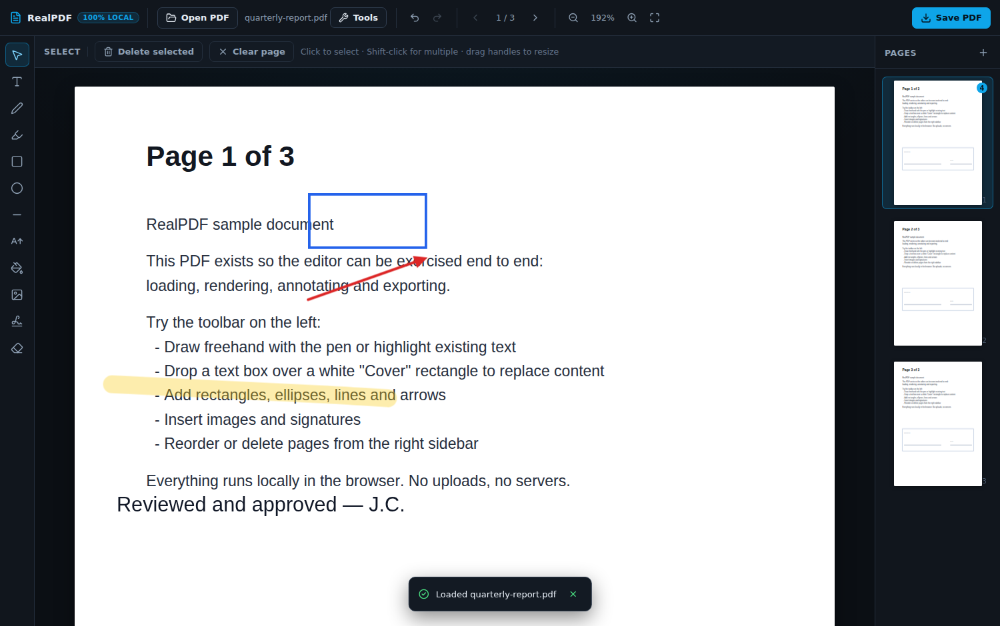
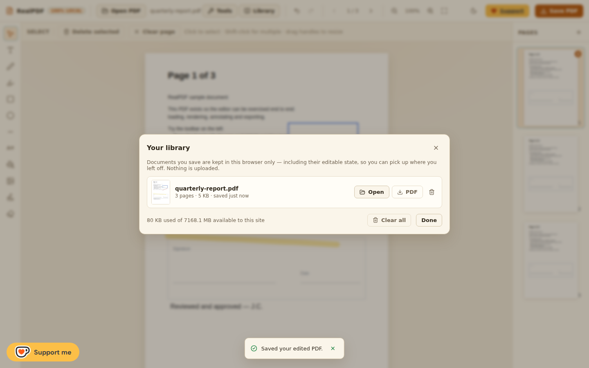
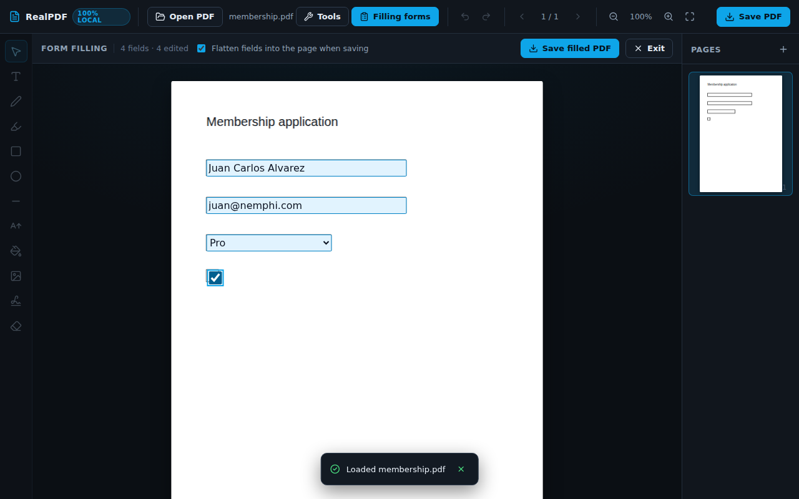
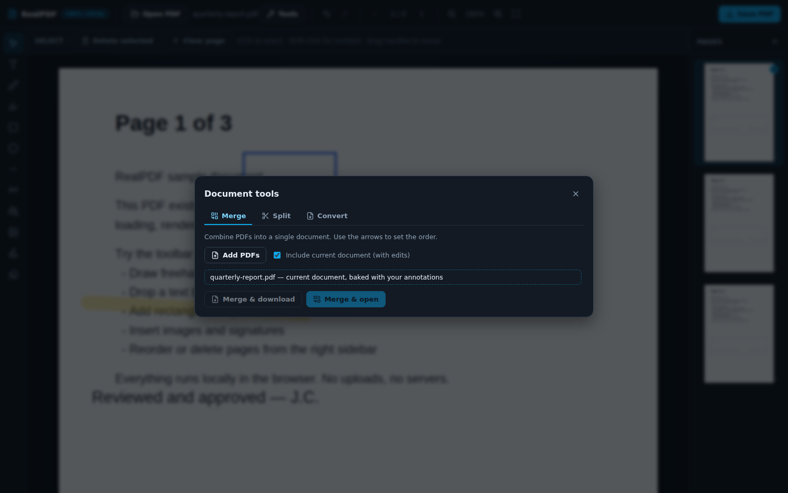
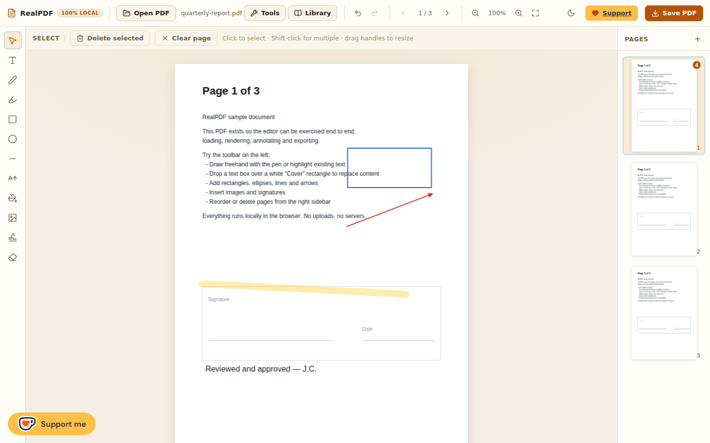

# RealPDF

A real PDF editor that runs **entirely in your browser**. No uploads, no accounts — your documents never leave your device. The only exception is a signing request you choose to send, and that is encrypted in the browser first (see below).




## Features

**Edit & annotate**

- Freehand pen, highlighter (multiplied blend, like a real marker) and eraser
- Text boxes with font family/size/color, rectangles, ellipses, lines and arrows
- **Edit any drawn result, not just text**: selecting an annotation shows the options of the tool that produced it, pre-filled with that object's own values, and changing them restyles the selection in place — a cover's fill, a rectangle/ellipse/line/arrow's colour and width (the arrow head follows its line), a pen stroke or highlight, and text (selecting text activates the text tool so its font, size and colour can be edited right away). Multi-selections, undo/redo and export all keep up; see [docs/selection-options.md](docs/selection-options.md).
- **Edit existing text in place**: click any text and retype it — the original font (bold/italic included), size, colour and position are matched, and the box grows along the baseline as you type so the replacement never wraps. The original glyphs are **deleted from the page's content stream** (the text layer, search and copy see the new text only), with the replacement embedded using the same font program (subset per font). The canvas **previews the final page automatically**: the original glyphs disappear from the rendered page as you edit (no fake background box, so text over artwork/stripes previews correctly), and undo brings them back. Re-click an edit to keep changing it, or erase it to reveal the original. A replacement that is selected can also be restyled with the text options.
- Cover existing content with white boxes and type over it to "replace" text
- Insert images (drag & drop or file picker) and signatures — draw them or **upload a photo/scan** (with automatic white-background removal)
- Select, move, resize, rotate and delete annotations, multi-select with Shift
- Undo/redo, zoom (25%–400%), fit-to-width, page navigation

**Signing (certificate-based, like DocuSign or Acrobat Sign)**

- A **Sign** button in the top bar with two choices: *Sign yourself* and *Request signatures*
- **Adopt your signature** once per device: your name and email, and a signature you **type** (three script fonts), **draw** or **upload**. RealPDF confirms the email with a 6-digit code and its CA issues a certificate for that address (valid one year, subject `CN=<name>, OU=Email verified by RealPDF, E=<email>`). The key pair is generated in the browser as non-extractable and only the public key is sent; the signer and their signature are remembered on the device, so next time Sign goes straight to placing. Only the email is verified, not the name
- **Your own certificate** instead: *Use a certificate file* opens a PKCS#12 file (`.p12` / `.pfx`, RSA or ECDSA P-256/384/521) with its password **in the browser**; the certificate, its private key and the password never leave the device
- **Place, review, done**: the editing tools step aside while you sign. Click on the page (or drag a box) to drop your signature, drag it to move or resize it, or click a **"Sign here"** tag on the document's empty signature fields. A *Start* flag points at the next tag, and a document with tags shows them before you create a signature, which happens at the first one. Once every tag is signed the bar says *Ready to finish?*; *Finish* shows a review step (with reason, location and certify under *More options*) and the done step offers the download. The handwritten signature is embedded in the certified signature's appearance, next to "Digitally signed by", the name and the date
- Standard **PAdES** signatures (`ETSI.CAdES.detached`, SHA-256, with the signer's certificate chain and the signing-certificate-v2 attribute), which Adobe Acrobat/Reader and other validators check as digitally signed documents
- **Countersigning**: an unchanged document is signed as an *incremental update* (the original bytes are kept and the signature is appended), so signatures already in the file stay valid
- **Certify** (DocMDP): the first signer can lock the document so that any change other than filling forms and signing invalidates it
- **Request signatures**: list the signers (name, optional email), place a "Sign here" field for each (added to the PDF as empty signature fields named after the signer), and get a link like `https://realpdf.app/sign/<id>#<key>` plus an email draft addressed to them. The document is encrypted in the browser with AES-256-GCM before upload and the key exists only in the link's `#fragment`, which browsers never send to the server, so the server stores ciphertext it cannot read (file name and message included). Whoever opens the link presses *Start signing*, sees their tags, creates a signature at the first one and fills them, and the signed copy is uploaded back to the same link (encrypted again); the sender opens the link to see who signed and download the result. Links expire after 30 days, and the sender can delete them earlier from the home screen or the dialog
- **Remembered on this device**: the key is kept in this browser's IndexedDB as a non-extractable WebCrypto key, so later signatures need neither the file, the password nor a new code; the browser can sign with it but no script can read it back, and *Forget* in the signature dialog removes it. Nothing is uploaded
- **For agents (MCP)**: `https://realpdf.app/mcp` lets AI agents send a PDF for signature, see who has signed, download the signed copy and verify any PDF's signatures; see [docs/mcp.md](docs/mcp.md)

**Local library**



- Every Save as PDF is also recorded in this browser (IndexedDB): title, page count, size, thumbnail and timestamp
- Documents keep their **editable state** — annotations, page order and form values — so **Open** resumes exactly where you left off
- Rename, rebuild/download the PDF, delete single entries or clear everything; storage usage is shown
- Recent work appears on the homepage for one-click resume

**Pages**

- Reorder pages by dragging thumbnails, delete pages, insert blank pages, or download one page as a PNG image
- Annotations are kept per page and survive reordering and scrolling (the viewer virtualizes pages)

**Forms**



- Detects AcroForm fields and overlays real inputs on top of the PDF: text fields, multiline text, checkboxes, radio groups, dropdowns and list boxes
- Values are written into the PDF on save, flattened by default so they render everywhere

**Document tools**



- **Merge** — combine any number of PDFs (optionally including the document you are editing, with annotations baked in), choose the order, download or open the result
- **Split** — extract page ranges (`1-3,5,8-`) or split every page into a ZIP
- **PDF → Images** — export pages as PNG or JPEG at 72/144/216 dpi, single page or all pages as a ZIP
- **PDF → Text** — download the text layer as `.txt`
- **Images → PDF** — turn PNG/JPEG/WebP/GIF/BMP files into a PDF, fit to A4 or page-per-image
- **Text → PDF** — render plain text into a paginated A4 PDF
- **Office → PDF** — open Word (`.docx`), Excel (`.xlsx`) and PowerPoint (`.pptx`) files and convert them into editable PDFs: paragraphs, headings, lists, tables, merged cells, multiple sheets/slides and inline images are rebuilt with pdf-lib (no server, no native engine)
- **PDF → Office** — export the current document (with your edits baked in) as an editable Word (`.docx`), Excel (`.xlsx`) or PowerPoint (`.pptx`) file: positioned text runs, page breaks, one sheet per page and one slide per page

Everything the tools produce uses your **current edited state** (annotations, page order, filled forms), not just the original file.

## Themes

Light (warm, paper-like) and dark themes, following your system preference by
default, with a one-click toggle in the toolbar.



## Languages

The interface ships in English, Spanish, French and German, with a picker in
the toolbar. The browser language is detected on the first visit, the chosen
language is remembered, and `<html lang>` / `dir`, the document title and
number/date formatting follow it. Adding a language is one dictionary file plus
one registry entry — see [docs/localization.md](docs/localization.md).

## Quick start

```bash
npm install
npm run dev          # http://localhost:5173
```

Production build (fully static, deploy anywhere):

```bash
npm run build        # outputs dist/ (includes the pdf.js worker + wasm/fonts/cmaps assets)
npm run preview
```

## How it works

| Layer | Technology |
| --- | --- |
| PDF rendering | [pdf.js](https://mozilla.github.io/pdf.js/) — Web Worker + **WebAssembly** decoders for JPEG 2000/ICC/JBIG2 (`wasm/`), plus CMaps and standard font data, all served from your own origin |
| Editing surface | [fabric.js](https://fabricjs.com/) canvas overlays (one per visible page), coordinates stored in PDF points |
| Signing service | The Worker's `/api/` routes (`worker/api.ts`): encrypted signing requests in an R2 bucket (`worker/signRequests.ts`), email verification codes sent with Cloudflare Email Sending and a small CA that issues signing certificates (`worker/signingIdentity.ts`, `worker/certificateAuthority.ts`). The Vite dev and preview servers serve the same routes from memory (`worker/devServer.ts`), with the emailed codes readable at `/api/dev/outbox` |
| Digital signatures | [node-forge](https://github.com/digitalbazaar/forge) reads the PKCS#12 file and encodes the CMS/ASN.1 structures; hashing and the private-key operation run in WebCrypto. The signature, its field and appearance are written as a hand-rolled incremental update (xref table or xref stream, matching the file) over pdf-lib objects (`src/lib/signing/`), loaded only when the signing dialog opens |
| Saving | [pdf-lib](https://pdf-lib.js.org/) — annotations are re-drawn as native PDF operators, images embedded, new text mapped to Standard-14 with Noto fallback subsets for other scripts and emoji, edited text embedded with its original font (subset) after rewriting the page's content streams to delete the original glyphs, highlights exported with a real Multiply blend mode. The same content-stream rewrite is applied to a scratch page and re-rendered with pdf.js while editing, so the on-screen preview matches the saved file |
| State | [zustand](https://zustand.docs.pmnd.rs/) store with snapshot-based undo/redo |
| ZIP export | dependency-free STORE-method zip writer (`src/lib/zip.ts`), with optional DEFLATE via pako for Office packages |
| Office import | a dependency-free ZIP reader over pako (`src/lib/zipRead.ts`) + OOXML parsing with `DOMParser` (`ooxml.ts`, `docxToPdf.ts`, `xlsxToPdf.ts`, `pptxToPdf.ts`); shared text layout re-uses pdf-lib Standard-14 fonts (`pdfLayout.ts`) |
| Office export | OOXML parts generated directly and packed with the zip writer (`pdfToOffice.ts`), using pdf.js text content with positions |
| Localization | dependency-free typed dictionaries (`src/i18n/`) with `Intl.PluralRules` plurals and locale-aware number/date formatting |

Export works by walking every stored annotation, inverting the pdf.js viewport transform to get PDF user-space coordinates, and drawing lines/rectangles/ellipses/text/images with pdf-lib. Rotation and non-standard page boxes are handled by the same inverse transform, so what you see is what gets written.

### Keyboard shortcuts

| Key | Action |
| --- | --- |
| `V` `T` `X` `P` `H` `R` `O` `L` `A` `W` `I` `S` `E` | select, text, edit text, draw, highlight, rectangle, ellipse, line, arrow, cover, image, signature, eraser |
| `Ctrl/Cmd + Z` / `Ctrl/Cmd + Shift + Z` | undo / redo |
| `Ctrl/Cmd + S` | save (download) the PDF |
| `Ctrl/Cmd + O` | open a PDF or Office file |
| `Ctrl/Cmd + scroll` | zoom |
| `Delete` | delete selection |
| `Esc` | deselect / back to select tool |

## Deploying to Cloudflare Workers

The editor is static, so it deploys as a Workers static-assets project — no
origin server, and the pdf.js WebAssembly decoders, fonts and CMaps (plus the
Noto fallback font slices, emitted as hashed assets) are served
from your own domain (there is no CDN call to a third party). A small Worker
(`worker/index.ts`) sits in front of the assets to log/trace requests, to
redirect `www` to the apex domain, and to serve the signing service under
`/api/` (see *Signing service setup* below).

```bash
npm run deploy      # builds and runs `wrangler deploy`
# or, to test the Cloudflare runtime locally first:
npm run cf:dev      # builds and runs `wrangler dev`
npm run types       # regenerate worker-configuration.d.ts after config changes
```

`wrangler.jsonc` points the Worker at `./dist`, attaches the `realpdf.app` and
`www.realpdf.app` custom domains on deploy, serves assets through the `ASSETS`
binding (`run_worker_first`), turns on Workers Logs and Traces, and declares an
empty `previews` block so Workers Builds can create branch previews with
`npx wrangler preview`:

```jsonc
{
  "name": "realpdf",
  "main": "worker/index.ts",
  "assets": {
    "directory": "./dist",
    "not_found_handling": "single-page-application",
    "binding": "ASSETS",
    "run_worker_first": true
  },
  "previews": {},
  "observability": {
    "enabled": true,
    "logs": { "enabled": true },
    "traces": { "enabled": true }
  },
  "routes": [
    { "pattern": "realpdf.app", "custom_domain": true },
    { "pattern": "www.realpdf.app", "custom_domain": true }
  ]
}
```

Remove the `routes` block if you prefer to attach the domains from the
Cloudflare dashboard. `public/_headers` adds long-lived caching for hashed
assets and a week for `pdfjs-assets/`, plus `nosniff` / frame / referrer
hardening — because `run_worker_first` bypasses `_headers`, the Worker
re-applies those rules to every asset response.

### Signing service setup

Signing links and email-verified signing IDs need three things the static app
does not:

1. **R2 bucket** `realpdf-signing` (binding `SIGN_STORE`). `wrangler deploy`
   creates it if it does not exist. A daily cron (`17 3 * * *`) deletes expired
   requests and verification codes.
2. **Email Sending** for the `m.realpdf.app` subdomain, so the `EMAIL` binding can send the
   codes from `sign@m.realpdf.app` (Cloudflare dashboard → Email → Email Sending,
   add the domain and its DNS records).
3. **The CA** that issues the certificates, as two Worker secrets:

   ```bash
   node scripts/make-signing-ca.mjs          # writes .signing-ca/ca-key.pem and ca-cert.pem (gitignored)
   npx wrangler secret put SIGNING_CA_KEY < .signing-ca/ca-key.pem
   npx wrangler secret put SIGNING_CA_CERT < .signing-ca/ca-cert.pem
   ```

   Keep `ca-key.pem` somewhere safe offline and delete it from disk: anyone
   with it can issue RealPDF certificates.

Until email and the CA are set up, `/api/identity/*` answers `503` and the app
says signing IDs are unavailable (certificate files and signing links keep
working). Uploads and certificate requests are rate-limited per IP
(`WRITE_LIMIT`), and verification emails per IP and per address
(`EMAIL_LIMIT`). For local testing with the real runtime, put the two secrets
in `.dev.vars` and run `npm run cf:dev`; emails are then written to
`.wrangler/tmp/email/` instead of being sent.

### Logs and traces

Workers Logs and Traces are visible in the Cloudflare dashboard under
**Workers & Pages → realpdf → Logs** and **Traces**. The Worker emits one
structured JSON line per request (`event`, `method`, `host`, `path`, `status`,
`durationMs`, `colo`, `country`) and wraps request handling in a
`realpdf:request` span with `http.response.status_code` / `http.response.duration_ms`
attributes. Every request is sampled (`head_sampling_rate: 1`); lower the rate
in `wrangler.jsonc` if volume grows. Query strings are never persisted
(`redact_query_string`), and document contents are never logged — everything
still happens in the browser. `www.realpdf.app` 301-redirects to
`https://realpdf.app`, preserving the path and query string.

## Tests

The suites run on [Vitest](https://vitest.dev/): headless-browser end-to-end
tests (Playwright) drive real pointer input and verify the exported PDFs by
re-rendering them, and unit tests exercise the content-stream rewriting without
a browser. The global setup writes the shared fixtures and starts its own Vite
server, so a single command is enough:

```bash
npm test             # vitest run: unit + all end-to-end suites
npm run test:watch   # the same, in watch mode
npm test -- tests/e2e/text-edit.test.mjs   # one suite
# or target a running server (for example the production build):
APP_URL=http://localhost:4173/ npm test
```

- `tests/unit/content-edit.test.mjs` — text-run matching and content-stream rewriting (form XObjects, rotated text, split `TJ` arrays)
- `tests/e2e/editor.test.mjs` — load, annotate with every tool, eraser, undo/redo, virtualization, page ops, export → reopen verification, non-embedded standard font rendering
- `tests/e2e/tools.test.mjs` — merge, split range, PDF→PNG, PDF→text, images→PDF, text→PDF, form filling → exported value verification
- `tests/e2e/ui.test.mjs` — theme toggle, homepage tool cards, signature image upload, Ko-fi button, language switch (persistence, translated strings, `<html lang>`/title)
- `tests/e2e/library.test.mjs` — save to the local library, rename, persistence across a reload, restore annotations, rebuild the PDF, delete
- `tests/unit/sign.test.mjs` — PKCS#12 loading (3DES, AES, OpenSSL-made RSA/ECDSA files), wrong passwords, PAdES signatures over xref tables and xref streams, countersigning, filling an empty signature field, certification — every signature checked with Node's crypto, independently of the app's code
- `tests/unit/verify.test.mjs` — signature verification: signer, chain and trust anchors, tampered bytes, content appended after signing, countersignatures and certification, ECDSA
- `tests/unit/mcp.test.mjs`, `tests/unit/mcp-requests.test.mjs` — the `/mcp` endpoint (JSON-RPC, errors, batches, CORS) and signing requests created by an agent, signed through the app's client with an email-verified certificate, then checked and downloaded by the agent
- `tests/e2e/digital-sign.test.mjs` — Sign yourself with a certificate file and a drawn signature: place, review, download and verify the signed PDF (byte range, CMS signature, embedded signature image, field position, rendered appearance), then countersign with a typed signature and check both signatures; remembered signers (stored keys not exportable) are reused after a reload and forgotten
- `tests/unit/signing-api.test.mjs` — signing requests (versions, write/owner tokens, concurrent uploads, expiry, rate limiting) and email-verified certificates (codes, attempt limits, proof of key possession, issued certificate checked with Node's crypto)
- `tests/e2e/sign-request.test.mjs` — a sender lists two signers and places a field for each, creates a signing link (only ciphertext is uploaded, the key never is), a signer without a certificate adopts a typed signature confirmed by email and fills their field, and the sender downloads the signed copy through the same link and deletes the request
- `tests/e2e/unicode-text.test.mjs` — added text outside WinAnsi (extended Latin, Greek, Cyrillic, CJK, Hangul, emoji) exports with embedded Noto subsets, WinAnsi-only text embeds nothing extra, typed line breaks survive
- `tests/e2e/text-edit.test.mjs` — edit embedded-font and standard-font text: text layer deletion, exported font programs, coloured backgrounds
- `tests/e2e/text-select.test.mjs` — selecting text activates the text tool, its options reflect and restyle the selected text, and the changes survive export
- `tests/e2e/selection-options.test.mjs` — selecting covers, shapes, arrows, highlights and drawings shows their tool options, restyles the selection (arrow head included), survives undo/redo and export
- `tests/e2e/office.test.mjs` — Word/Excel/PowerPoint → PDF (text, tables, merged cells, embedded images) and PDF → Word/Excel/PowerPoint (OOXML parts, page breaks, one sheet/slide per page)
- `tests/unit/zip.test.mjs` — ZIP round-trips for stored and deflated Office packages

All suites pass against the Vite dev server, the production build and the local
Cloudflare Workers runtime (`npm run cf:dev`).

## Limitations (honest list)

- **Existing text is replaced, not re-flowed.** Editing a run deletes the matching text-showing operators from the page's content stream (including inside form XObjects) and draws the replacement at the original position, so surrounding lines never move. Reflowing paragraphs would require a real content-stream layout engine. When a run cannot be located with certainty (shared form XObjects drawn at different transforms, `TJ` arrays that pdf.js splits, encrypted streams), the exporter falls back to the older behaviour: the original is covered with the colour sampled from the page behind it.
- The replacement font comes from the font program pdf.js rebuilds from the embedded font (the same outlines the viewer shows). Fonts pdf.js cannot hand over (Type 3, some non-embedded standard fonts) fall back to the closest Standard-14 family. Characters a subsetted font does not contain are drawn with the run's Standard-14 family (same weight and slant), or with the bundled Noto Sans (Latin, Greek, Cyrillic) when WinAnsi cannot encode them; only characters neither covers (CJK, emoji, …) are written as `?`.
- **Office conversion is content-level, not pixel-faithful.** Word/Excel/PowerPoint files are parsed in the browser (ZIP + OOXML) and rebuilt with pdf-lib: text, tables, lists, inline images and basic paragraph/run styling (bold, italic, underline, colour, size, alignment) survive, while complex layouts, themes, charts/SmartArt, embedded objects, macros, headers/footers and exact fonts (they are matched to the Standard-14 substitutes) do not. Exporting a PDF back to Office preserves the text, its position, basic emphasis and the page/sheet/slide structure — not the original PDF's exact layout. Legacy `.doc/.xls/.ppt`, OpenDocument and macro-enabled variants are not supported.
- Text you add is exported with the Standard-14 fonts (Helvetica/Times/Courier). Characters outside WinAnsi fall back to bundled Noto fonts, embedded as glyph subsets only when the text needs them: Noto Sans (extended Latin, Greek, Cyrillic, Vietnamese), Noto Sans SC (Chinese, Japanese kana), Noto Sans KR (Hangul) and Noto Emoji (emoji, drawn as monochrome outlines since PDF fonts cannot carry colour glyphs). The fallback glyphs are always upright sans-serif (Noto Sans in regular only, the CJK and emoji fonts in regular or bold), so they do not follow Times/Courier or italic, and Han characters use Simplified Chinese glyph shapes. Scripts outside those fonts (Arabic, Hebrew, Indic, Thai, …) and right-to-left layout are not supported and still export as `?`. Existing text rendering supports embedded fonts and CJK via pdf.js CMaps.
- Very large documents (hundreds of pages) work but page rendering is limited to a window around the viewport; extremely large images increase memory usage.
- Filling forms flattens by default (recommended); unflattened export relies on pdf-lib copying widgets, which is best-effort.
- Password-protected PDFs are supported for viewing/editing when you know the password.
- **RealPDF signing IDs verify an email address, not a person.** Readers like Adobe Acrobat show those signatures as intact but the signer as unknown until the recipient trusts RealPDF's CA certificate (download it from `/api/identity/ca.pem`); RealPDF is not on the Adobe Approved Trust List. A signing ID lives in one browser: clearing site data or switching devices means creating a new one (the key cannot be exported, by design).
- **Digital signatures are basic PAdES (B-B level).** There is no trusted timestamp (the signing time is the device clock), no revocation data embedded for long-term validation, and no remote or smart-card signing — the certificate must be a RealPDF signing ID or a `.p12`/`.pfx` file with its private key. Whether a reader shows the signature as *trusted* depends on the certificate: one issued by a CA on the Adobe Approved Trust List or the EU trusted lists validates out of the box, a self-signed one only after the recipient trusts it. Signing a document you edited signs the edited copy, which invalidates signatures already in the original; sign before editing to keep them. Certifying signatures always allow form filling and signing (DocMDP level 2), and new visible signature boxes added after a certification may be reported as changes by strict validators, so later signers should use the document's empty signature fields (their “Sign here” tags).
- The library lives in your browser profile: clearing site data removes it, and it is not synced between devices.
- The app makes no third-party requests until someone opens the Support dialog, which frames Ko-fi's donation panel from `ko-fi.com` in a cross-origin iframe; no Ko-fi script runs in the app's own page.

## Project layout

```
src/
  components/     UI: toolbar, tool rail, viewer, page sidebar, modals, form overlay
  i18n/           locale registry, detection, plurals, t() and the language picker
  lib/
    pdfjs.ts      pdf.js setup + local wasm/font/cmap assets
    export.ts     fabric → pdf-lib annotation drawing
    fonts/        Noto fallback fonts for characters the Standard-14 fonts lack (loaded on demand)
    textEdit.ts   existing-text hit-testing, font reuse, colour sampling
    annotationStyle.ts  selected-result kind, style read/apply (covers, shapes, paths)
    contentEdit.ts  content-stream walk that deletes edited text runs
    forms.ts      AcroForm discovery + value writing
    pdfOps.ts     merge, extract, image/text conversion
    currentDocument.ts  "bake" the edited document for tools/export
    signing/      PKCS#12 identities, CMS (PAdES) signatures, the incremental-update writer and verification
    signController.ts  signing flow: which bytes to sign, placement, download
    signRequests.ts  signing links: encryption, the link format, the /api/sign-requests client
    signRequestController.ts  opening a link in the editor and sending signed copies back
    serialize.ts  annotation JSON (assets kept out of undo snapshots)
    zip.ts        minimal ZIP writer (STORE, optional DEFLATE)
    zipRead.ts    ZIP reader for Office packages
    ooxml.ts      OOXML helpers: XML, relationships, units, WinAnsi text
    pdfLayout.ts  shared wrapped-text layout over pdf-lib Standard-14 fonts
    docxToPdf.ts  WordprocessingML → PDF (paragraphs, lists, tables, images)
    xlsxToPdf.ts  SpreadsheetML → PDF (sheets, styles, merges, pagination)
    pptxToPdf.ts  PresentationML → PDF (slides, placeholders, tables, images)
    officeToPdf.ts  format detection + dispatcher
    pdfToOffice.ts  PDF text extraction + Word/Excel/PowerPoint exporters
  store.ts        single zustand store (pages, history, tools, forms)
scripts/          sample generator, screenshots, visual checks
tests/            vitest suites: helpers, unit tests, browser end-to-end tests
```
